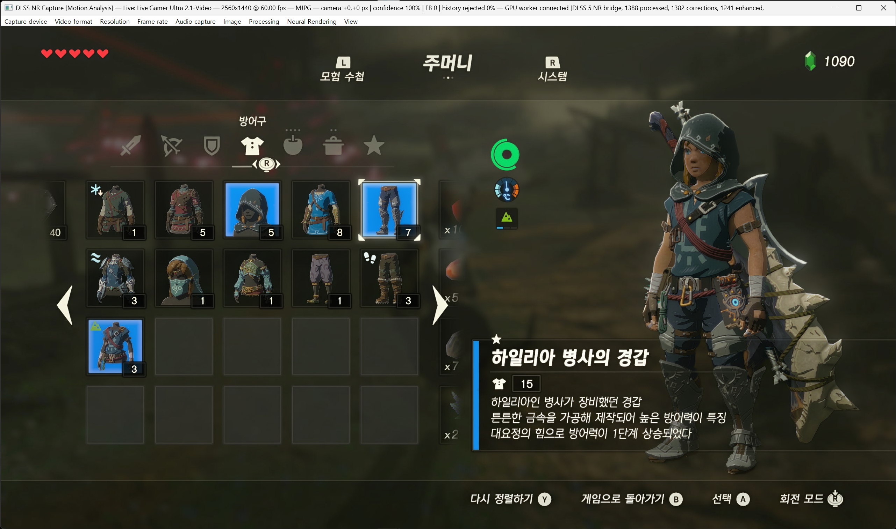

# DLSS NR Capture

**English** | [한국어](README.ko.md)

A low-latency Windows capture viewer with experimental Neural Rendering. View
video and audio from a capture card on your PC, optionally enhancing captured
frames with a compatible NVIDIA NR runtime supplied separately by the user.
Processing happens on captured video; the application does not inject a mod
into the source game.



*User-provided application screenshot. The title bar shows a Live Gamer Ultra 2.1
input at 2560×1440, 60 FPS, MJPG, with a connected NR worker. The 60 FPS value is
the selected input mode, not a guarantee of NR processing or presentation speed.
This is an application example, not a before/after comparison or a quality
benchmark. Game imagery and trademarks belong to their respective owners.*

## Features

- Media Foundation capture-device discovery and device-supported video format,
  resolution and frame-rate selection. Formats include RGB24/RGB32, NV12, P010,
  YUY2, UYVY and MJPG, subject to device support.
- D3D11 flip-model presentation and a bounded latest-frame queue that drops
  stale frames instead of building an unlimited video backlog.
- Optional NR worker, shared GPU textures, optical flow, temporal-history
  handling and passthrough on runtime failure.
- NR style and intensity, plus experimental tone/structure, source-color
  preservation, highlight protection, 100/75/50% NR resolution and 1/2/3 passes.
- Reduced-resolution processing composites the small NR image's changes onto
  the full-resolution original instead of simply enlarging the processed image.
- Frame-matched comparison, draggable divider, side swapping, held-frame
  inspection and centered 1×/2×/4× zoom.
- Audio capture/playback, manual delay and optional experimental automatic A/V sync.
- Fullscreen with an auto-hiding top menu, always-on-top, DPI-aware sizing,
  saved settings, diagnostics and device/worker recovery.

Multiple NR passes increase processing and memory costs and can accumulate
artifacts. No particular appearance, frame rate or end-to-end latency is guaranteed.
Preset hints being passed to the runtime do not establish a visible effect.

## Get started

Download a public package from [Releases](https://github.com/lesser-vr/dlss-nr-capture/releases),
or build from source below. Keep the app, worker, adapter and bridge from the
same build together; do not mix binaries from different releases.

1. Connect a Media Foundation-compatible capture device and launch `dlss-nr-capture.exe`.
2. Choose **Capture device**, **Video format**, **Resolution** and **Frame rate**.
3. Select an input under **Audio capture** if audio playback is needed.
4. For NR, place a legally obtained compatible `nvngx_dlssnr.dll` in the app's
   `nr-runtime/` directory, then press **F10**. A compatible NVIDIA GPU, driver
   and runtime combination is required; universal RTX-generation support is not established.
5. Start with one pass and inspect the result. Try a lower NR resolution if
   processing is too slow, checking moving details as well as still images.

The public package does **not** include NVIDIA's proprietary NR runtime. Missing
runtime errors identify the expected path; initialization or processing failure
falls back to original video.

## Controls

| Key or menu | Action |
| --- | --- |
| F10 | Toggle NR processing |
| F11 | Toggle fullscreen; move the pointer to the top edge to reveal the menu |
| F9 | Toggle original/NR comparison; entering comparison enables NR if needed |
| Tab (hold) | Temporarily show the original; with NR off, show guidance instead |
| F8 | Hold/release a completed comparison pair; capture and audio continue |
| Esc | Exit |
| Neural Rendering → Creative controls (experimental) | Resolution, color/highlight controls and 1/2/3 passes |
| View → Performance overlay | Capture/presentation/worker FPS, NR state, timing and drops |
| View → Refresh devices | Refresh inputs without automatically changing the active source |
| View → Copy diagnostics to clipboard | Copy settings, counters, timing and recovery information |

Processing-setting changes release a held comparison and restart NR as needed.
A held image is not reprocessed with new settings. Comparison adds copies and
memory costs and is not the lowest-latency viewing mode.

## Build

Requires CMake 3.24+, Visual Studio 2026 C++ Build Tools and the Windows SDK.

```powershell
cmake -S . -B build -G 'Visual Studio 18 2026' -A x64
cmake --build build --config Release
```

Run `build/Release/dlss-nr-capture.exe`. For source builds, place the separately
supplied runtime at `build/Release/nr-runtime/nvngx_dlssnr.dll`. Public bridge
and caller modules are built under `build/Release/nr-runtime/`.

GPU flow handoff defaults to ON in new CMake configurations, with CPU-transfer
fallback. **GPU-native capture is a separate experimental UI option, off by
default.** Existing CMake caches and user settings may differ. Check diagnostics
for the actual capture and flow paths.

## Validation and benchmarks

Follow the [regression policy](docs/regression-policy.md). Automated tests do not
certify subjective image quality, physical A/V latency or every capture driver.

```powershell
cmake --build build --config Release --target regression
# Or test an existing build
ctest --test-dir build -C Release --output-on-failure

# Run separately from the app and other GPU workloads
.\tools\benchmark.ps1 -InputVideo 'D:\clips\camera-pan.mp4'
.\tools\benchmark.ps1 -Synthetic -Warmup 30 -Frames 90
```

The benchmark defaults to 120 warmup frames and 300 measured frames. It writes
`frames.csv`, `summary.json` and a hash/settings manifest into a new output
directory. Compare identical inputs, settings and frame intervals. Offline
throughput is **not game FPS or live capture latency**. The timeout wrapper
records incomplete runs and forced cleanup; a timeout is not a successful test.

Use `-CaptureOutput` in a separate visual-review run: readback and file output
make it unsuitable for performance comparison. `-FullResolution` and region
options support native-resolution inspection. Quality metrics identify frames
for review, not an automatic visual-quality pass/fail.

```powershell
.\tools\compare-performance.ps1 -Baseline '.\build\baseline' -Candidate '.\build\candidate' -OutputDir '.\build\perf-comparison'
.\tools\compare-quality.ps1 -Baseline '.\build\quality-baseline' -Candidate '.\build\quality-candidate' -OutputDir '.\build\quality-comparison'
```

The reference video uses Git LFS. If only the pointer was checked out, run:

```powershell
git lfs install --local
git lfs pull
```

Detailed benchmark options and recovery behavior are also preserved in the
[Korean guide](README.ko.md).

## Limitations and troubleshooting

- This is a capture-device viewer, not a desktop/window-capture tool, video
  player, frame-generation implementation or VR integration.
- HDR/BT.2020 input is unsupported; use SDR. P010 availability does not imply HDR support.
- Reduced-resolution NR may cause halos or lose generated fine detail.
  Color/highlight preservation is an SDR approximation, not HDR reconstruction.
- Application latency covers capture callback arrival to Present return,
  excluding console, capture-card and monitor latency.
- Automatic A/V sync is experimental and off by default. Manual delay delays
  sound; it cannot advance it or calibrate external hardware.
- Recovery preserves device identity and exact mode rather than silently
  selecting another input. Physical reconnection and long-session stability
  still depend on hardware and drivers.
- Logs: `%LOCALAPPDATA%\DlssNrCapture\capture.log` and `capture.log.previous`.
  Captured media is not logged, but errors may include device names or paths.
  Review diagnostics before sharing them.

## Technical documentation

Some documents are in Korean and retain historical measurements; those numbers
do not automatically describe the latest build.

- [Creative controls and reduced-resolution composition](docs/nr-creative-controls.md)
- [Multi-pass behavior and validation](docs/nr-two-pass.md)
- [GPU capture pipeline](docs/gpu-capture-pipeline.md)
- [Capture stability and A/V sync](docs/capture-stability-sync.md)
- [A/V calibration and GPU-capture defaults](docs/av-calibration-gpu-default.md)
- [Shutdown and black-screen diagnostics](docs/shutdown-gpu-blackout.md)
- [GPU fence evaluation](docs/gpu-fence-evaluation.md)
- [Long-play validation limits](docs/long-play-validation.md)
- [Roadmap](docs/roadmap.md)

## Packaging and third-party components

Create a new package from a validated build:

```powershell
.\tools\package.ps1 -ReleaseDir '.\build\Release' -OutputDir '.\build\public-package'
```

The package includes public binaries, notices and SHA-256 checksums, excluding
proprietary NVIDIA runtimes and reference game video. See
[THIRD_PARTY_NOTICES.md](THIRD_PARTY_NOTICES.md) and the
[bridge license](third_party/comfyui_dlss5_nr/LICENSE).
This is an independent experimental project, not an official NVIDIA product.
